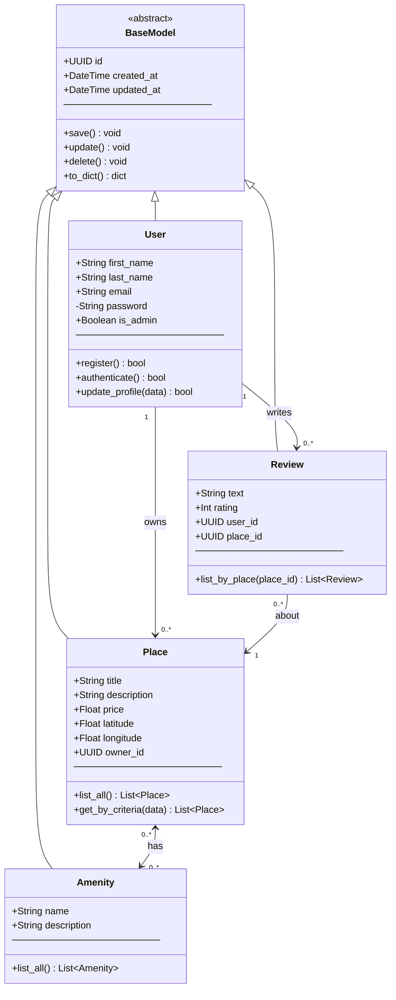

# Task 1 – Class Diagram: Business Logic Layer
 
## Overview
 
All entities share a common `BaseModel` that handles ID generation and timestamps. The four core entities (`User`, `Place`, `Review`, `Amenity`) inherit from it and form the backbone of the application.
 
---
 
## Class Diagram
 

 
---
 
## Entity Notes
 
### BaseModel *(abstract)*
Provides the shared foundation for every entity: a unique `UUID`, and `created_at` / `updated_at` timestamps. All persistence and update logic is centralized here to avoid duplication.
 
### User
Represents any registered person. The `is_admin` flag distinguishes administrators from regular users. The `password` field is private and must always be stored hashed. A user can be both a **host** (owning Places) and a **guest** (writing Reviews).
 
### Place
The core listing entity. Linked to its owner via `owner_id`. A Place can be associated with multiple Amenities (many-to-many), and can accumulate multiple Reviews over time.
 
### Review
Bridges a `User` and a `Place`. Contains a free-text comment and a numeric `rating`. A review can only exist if both the user and the place exist.
 
### Amenity
A simple descriptive entity (e.g. "WiFi", "Pool", "Parking"). Amenities are reusable and can be attached to multiple places.
 
---
 
## Relationship Summary
 
| Relationship | Type | Cardinality |
|---|---|---|
| User → Place | Association (owns) | 1 to 0..* |
| User → Review | Association (writes) | 1 to 0..* |
| Review → Place | Association (about) | 0..* to 1 |
| Place ↔ Amenity | Many-to-Many | 0..* to 0..* |