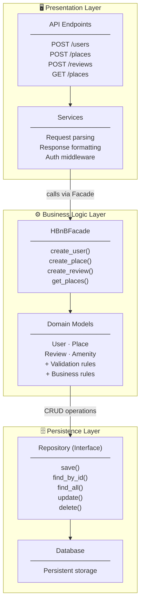

# Task 1 – High-Level Package Diagram
 
## Overview
 
The HBnB application follows a **3-layer architecture** (Presentation → Business Logic → Persistence), using the **Facade Pattern** to decouple layers and simplify inter-layer communication.
 
---
 
## Package Diagram
 

 
---
 
## Layer Responsibilities
 
### Presentation Layer
Entry point for all client requests (HTTP). It handles routing, authentication middleware, request parsing and response formatting. It contains **no business logic** — it delegates everything to the Business Logic Layer through the Facade.
 
### Business Logic Layer & Facade Pattern
The heart of the application. The **Facade** (`HBnBFacade`) exposes a clean, unified interface to the Presentation Layer, hiding the complexity of model interactions. For example, creating a review requires checking user existence, place existence, and reservation status — the Facade orchestrates all of this transparently.
 
### Persistence Layer
Responsible for all data storage and retrieval. The `Repository` interface abstracts the underlying database technology (SQL, NoSQL, file storage, etc.), so the Business Logic Layer never depends on implementation details.
 
---
 
## Why the Facade Pattern?
 
| Without Facade | With Facade |
|---|---|
| API must know about User, Place, Review models | API only calls one interface |
| Changes in models break API code | Changes are isolated behind the Facade |
| Hard to test layers independently | Each layer can be mocked independently |
 
The Facade acts as a **single point of contact** between the Presentation and Business Logic layers, reducing coupling and making the codebase easier to maintain and extend.