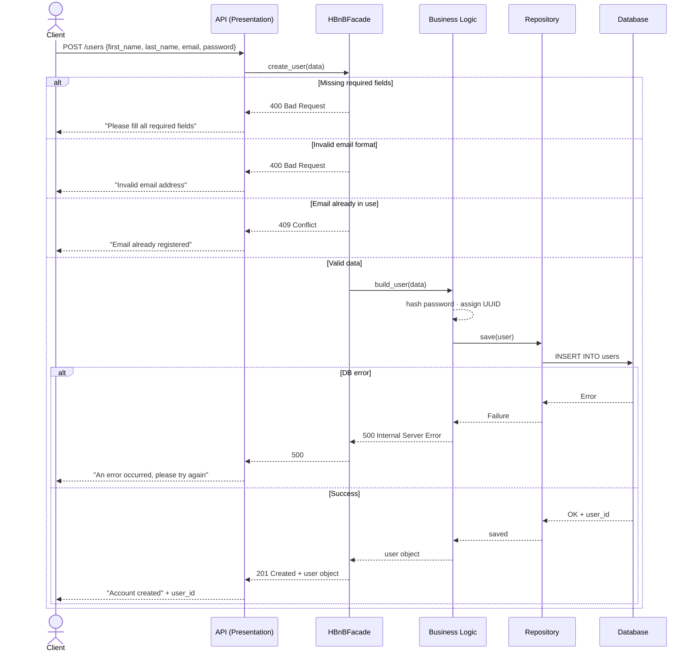
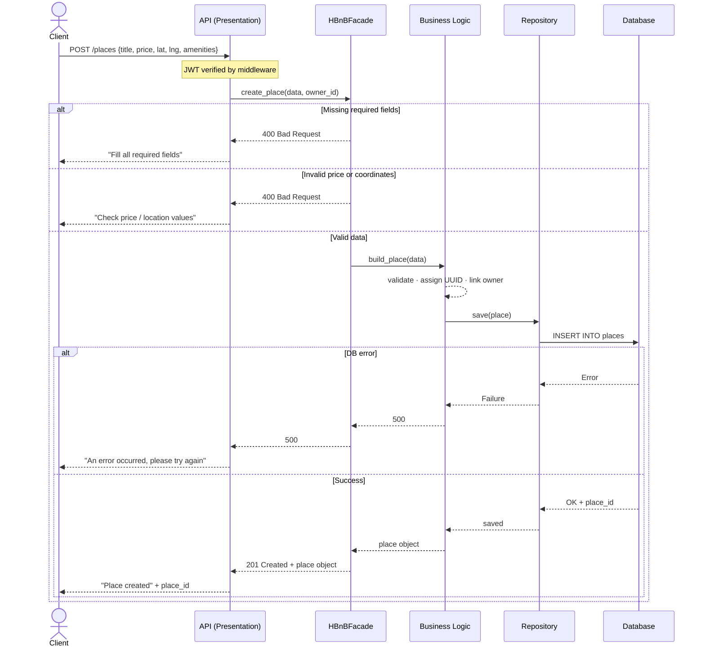
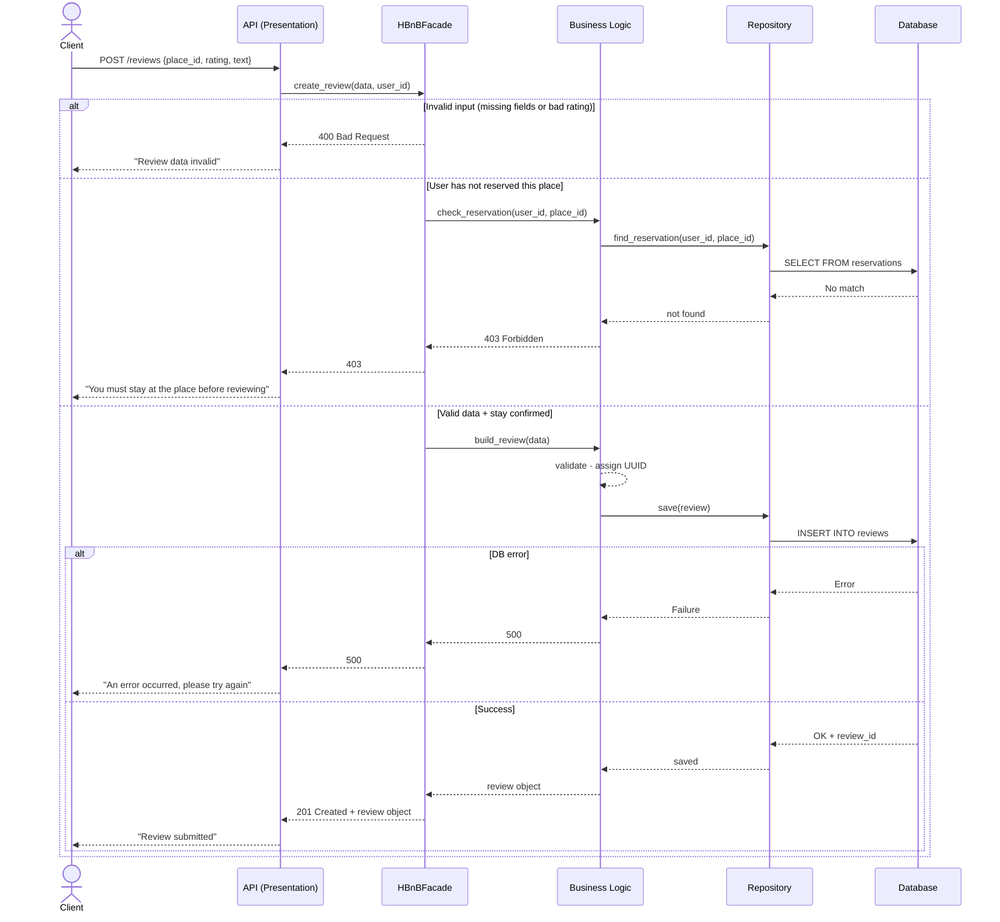
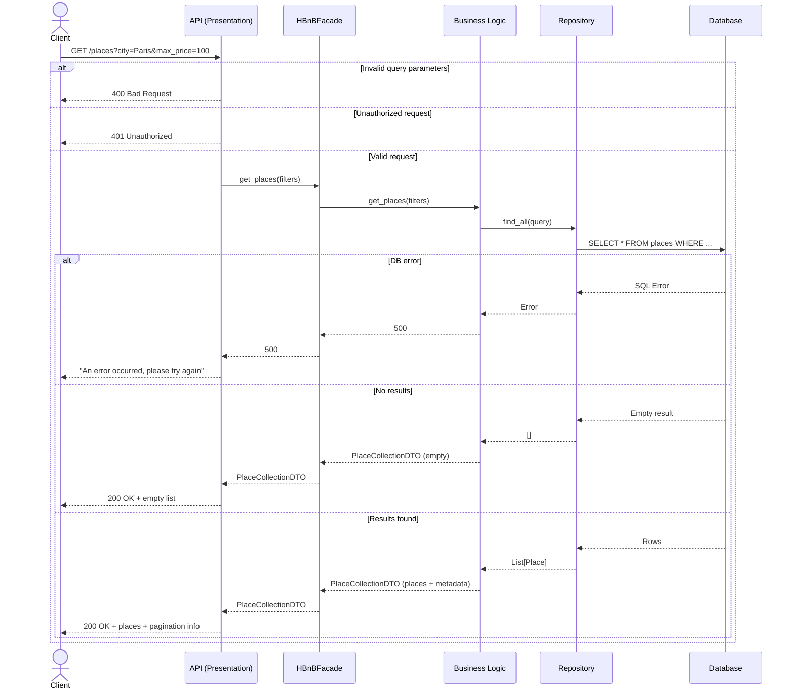

# Task 2 – Sequence Diagrams: API Interaction Flows
 
## Overview
 
These four diagrams illustrate how the three layers (Presentation, Business Logic, Persistence) collaborate to handle typical API requests. Each diagram follows the same pattern: the API delegates to the Facade, which orchestrates validation and model creation before persisting data.
 
---
 
## 4.1 – User Registration (`POST /users`)
 

 
> **Key point:** Password hashing and email uniqueness checks happen inside the Facade / Business Logic — never at the API level.
 
---
 
## 4.2 – Place Creation (`POST /places`)
 

 
> **Key point:** Authentication happens at the API middleware level. The Facade only receives already-authenticated `owner_id`.
 
---
 
## 4.3 – Review Submission (`POST /reviews`)
 

 
> **Key point:** The Facade enforces the **business rule** that only users with a confirmed stay can post a review — this logic never leaks into the API layer.
 
---
 
## 4.4 – Fetch Places (`GET /places`)
 

 
> **Key point:** The `PlaceCollectionDTO` wraps both the list of places and metadata (total count, applied filters, pagination) into a single clean response object, avoiding raw database exposure.
 
---
 
## Summary: Common Flow Pattern
 
Every API call follows the same layered flow:
 
```
Client → API (auth + parsing) → Facade (orchestration) → Business Logic (rules + validation) → Repository → Database
```
 
Errors are caught at the appropriate layer and propagated back with the correct HTTP status code, keeping each layer's responsibility clearly separated.